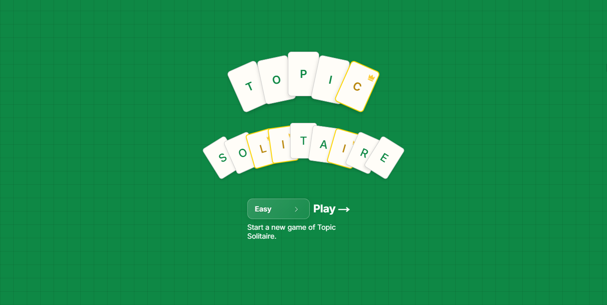
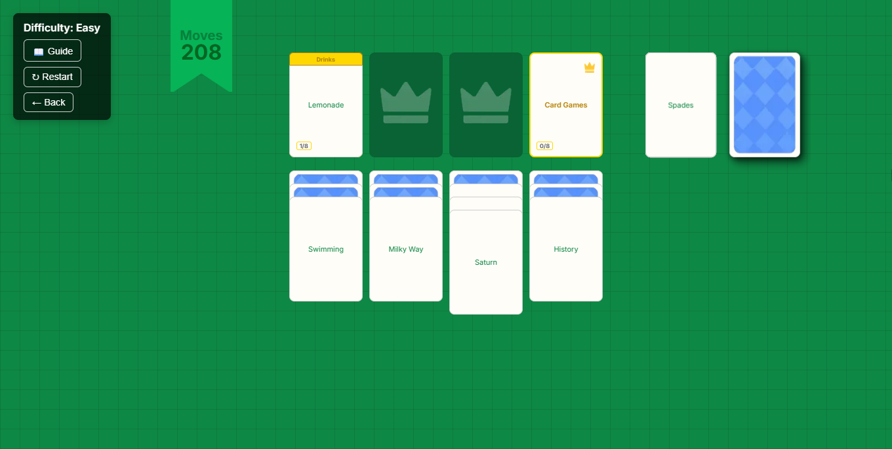

# Topic Solitaire

A strategic card game where you organize cards by matching them to their topics. Think solitaire meets categorization.

## What's the Game?

You get a deck of cards with different items such as "Tulip", "Volkswagen", or "Asteroid" and topic cards such as "Cars", "Flowers", or "Space". Your job is to figure out which items belong to which topics and organize them all before you run out of moves.



## How to Play

**The Strategy:**

- Topic cards (with the little crown & gold border) go in the top row
- Regular cards get matched to their topics
- Draw wisely - make sure to pay attention to which cards are drawn
- When the bottom card piles are empty, you can refresh the field with new cards



## Difficulty Levels

- **Easy:** Familiar topics like Animals, Cars, Fruits
- **Medium:** Mix of common and specific topics
- **Hard:** Challenging categories and fewer moves

# Running locally

- Fork the repository and clone it to your local machine
- Navigate to the project directory

- Install dependencies
- Run the following command in your terminal
  - Change pnpm to whatever installation command you have (npm, yarn, etc.)

```bash
pnpm install
pnpm dev
```

- Then open http://localhost:3000 and start playing.
